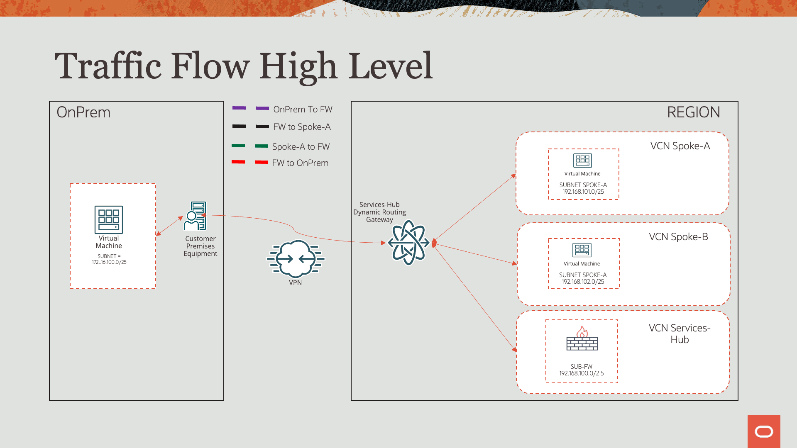
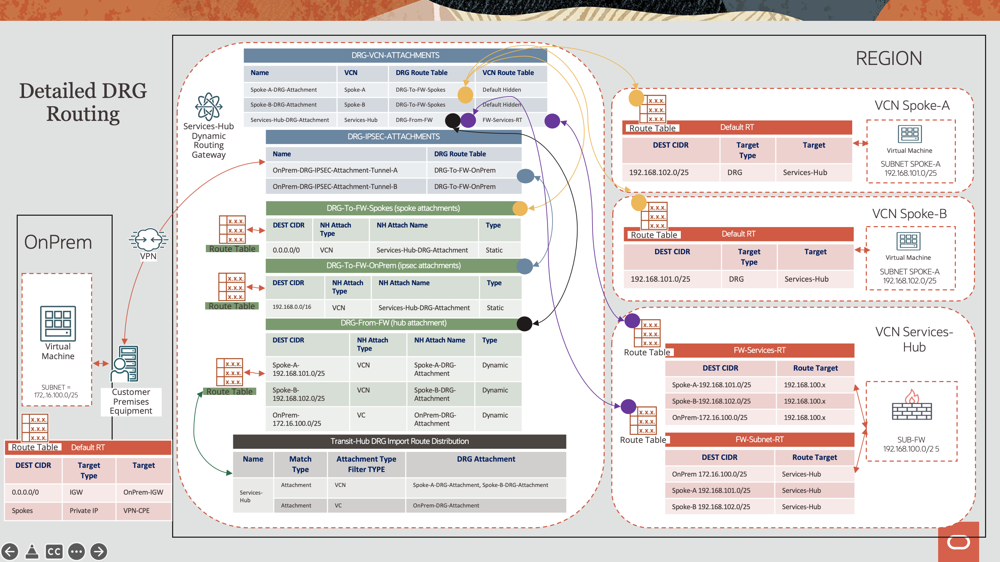

<div id="top"></div>
<!--
*** Thanks for checking out the Best-README-Template. If you have a suggestion
*** that would make this better, please fork the repo and create a pull request
*** or simply open an issue with the tag "enhancement".
*** Don't forget to give the project a star!
*** Thanks again! Now go create something AMAZING! :D
-->


<!-- PROJECT SHIELDS -->
<!--
*** I'm using markdown "reference style" links for readability.
*** Reference links are enclosed in brackets [ ] instead of parentheses ( ).
*** See the bottom of this document for the declaration of the reference variables
*** for contributors-url, forks-url, etc. This is an optional, concise syntax you may use.
*** https://www.markdownguide.org/basic-syntax/#reference-style-links
-->
<!-- [![Contributors][contributors-shield]][contributors-url] -->

[![LinkedIn][linkedin-shield]][linkedin-url]
![GitHubForks][forks-shield]
![GitHubIssues][issues-shield]
![GitHubRepoStars][stars-shield]
![GitHubDownloads][downloads-shield]

<!-- PROJECT LOGO -->
<br />
<div align="center">

  <h3 align="center">Using a DRGv2 to route traffic through a centralized network virtual appliance</h3>

</div>


<!-- TABLE OF CONTENTS -->
<details>
  <summary>Table of Contents</summary>
  <ol>
    <li>
      <a href="#about-the-project">About The Project</a>
      <ul>
        <li><a href="#built-with">Built With</a></li>
      </ul>
    </li>
    <li><a href="#Summary-of-OCI-Networking-and-Compute-Services">Summary of OCI Networking and Compute Services</a></li>        
    <li>
      <a href="#getting-started">Getting Started</a>
      <ul>
        <li><a href="#prerequisites">Prerequisites</a></li>
        <li><a href="#installation">Installation</a></li>
      </ul>
    </li>
    <li><a href="#Known Issues">Known Issues</a></li>
    <li><a href="#contact">Contact</a></li>
    <li><a href="#acknowledgments">Acknowledgments</a></li>
  </ol>
</details>


<!-- ABOUT THE PROJECT -->
## About The Project

Version 1.0.0

Transit routing refers to a network topology in which your on-premises network uses an intermediary to reach Oracle resources or services or VCNs. The intermediary can be a VCN or a dynamic routing gateway (DRG)  your on-premises network is already attached to. You connect the on-premises network to a DRG with FastConnect or Site-to-Site VPN, and then configure routing so that traffic transits through the intermediary to its destination.

Read more about Transit routing inside a services VCN [here](https://docs.oracle.com/en-us/iaas/Content/Network/Tasks/transitrouting.htm)

**Use Case:**

Access between multiple networks through a single DRG with a firewall between networks: This scenario uses the DRG as the hub, with routing configured to send packets through a firewall in a VCN before they can be sent to another network. See Using a DRG to route traffic through a centralized network virtual appliance. 

#### Built With:

Latest build on 01/08/2020.

Below are the versions of software that were used at the time this code was created.

* [Libreswan](https://libreswan.org/), version = 4.5
* [Quagga](https://www.quagga.net/), version = 1.2.0
* [Terraform](https://www.terraform.io/), version = 1.1.3
* [OCI Terraform Provider](https://registry.terraform.io/providers/hashicorp/oci/latest), version = 4.58.0
* [Ansible](https://www.ansible.com/), version = core 2.12.1

<p align="right">(<a href="#top">back to top</a>)</p>

## Summary of OCI Networking and Compute Services

This setup leverages four Oracle Cloud Infrastructure VCNs within the same tenancy.  Two VCNs act as Spoke-A and Spoke-B.  One VCN simulates an OnPrem data center connected to OCI via an IPSEC VPN.  The final VCN acts as a Services Tranist Hub where a Linux Virtual Machine is performing FW functions.

**OCI Services Hub:**
* VCN
* Subnet
* Route Table and Rules
* Security List and Rules
* Dynamic Routing Gateway (DRG)
* Internet Gateway (IGW)
* IPSec Connection
* Route Import Distribution Lists and Rules
* An Oracle Linux compute instance used for simulating a FW

**On-Premises Side:**
* VCN
* Subnet
* Route Table and Rules
* Security List and Rules
* Internet Gateway (IGW)
* A Libreswan compute instance acting as the CPE device running BGP (via Quagga)
* A Virtual Machine to simulate traffic flows to Spokes

**Spoke-A and Spoke-B:**
* VCN
* Subnet
* Route Table and Rules
* Security List and Rules
* Internet Gateway (IGW)
* A Virtual Machine to simulate traffic flows to Spoke and OnPrem

## Traffic Flow High Level

## Detailed DRG Routing


<p align="right">(<a href="#top">back to top</a>)</p>

<!-- GETTING STARTED -->
## Getting Started

### Prerequisites
1. Install Terraform
2. Install Ansible
3. Access to Oracle Cloud Infastructure
3. Download or clone the repo to your local machine
  ```sh
  git clone git@github.com:oracle-quickstart/oci-transit-fw.git
  ```
4. Update the *variables.tf* or terraform.tfvars file to match your enviornment
5. Update the */ansible/vpn_vars* files with the tunnel IP addresses
6. Run Terraform
  ```sh
  terraform init
  terraform plan
  terraform apply
  ```

<!-- CONTRIBUTING -->
## Contributing

Contributions are what make the open source community such an amazing place to learn, inspire, and create. Any contributions you make are **greatly appreciated**.

If you have a suggestion that would make this better, please fork the repo and create a pull request. You can also simply open an issue with the tag "enhancement".
Don't forget to give the project a star! Thanks again!

1. Fork the Project
2. Create your Feature Branch (`git checkout -b feature/AmazingFeature`)
3. Commit your Changes (`git commit -m 'Add some AmazingFeature'`)
4. Push to the Branch (`git push origin feature/AmazingFeature`)
5. Open a Pull Request

<p align="right">(<a href="#top">back to top</a>)</p>

<!-- CONTACT -->
## Known Issues

1. IPSEC Tunnel renaming Error

The following error is a know issue and will occur on first Terraform apply.  Re-apply Terraform and the issue will resolve on its own as a workaround

```Error: 409-IncorrectState 
│ Provider version: 4.56.0, released on 2021-12-08.  
│ Service: Core Ip Sec Connection Tunnel Management 
│ Error Message: Resource ocid1.iterrpsecconnection.oc1.iad.aaaaaaaa27zc7qypdgg47yl3qt7tltnx4no57k2ypxpm63vmcrmamthcciza is in an invalid state Provisioning 
│ OPC request ID: 1e68bf5cb7e3cabcd2b581e272a3786d/EDCB425B3A799CD3DAB519A133EE0443/D85A86FA9B06CF360219D4CA8F309170 
│ Suggestion: The resource is in a conflicted state. Please retry again or contact support for help with service: Core Ip Sec Connection Tunnel Management
│ 
│ 
│   with oci_core_ipsec_connection_tunnel_management.oci-ipsec-connection-tunnel-management-b,
│   on networking.tf line 305, in resource "oci_core_ipsec_connection_tunnel_management" "oci-ipsec-connection-tunnel-management-b":
│  305: resource "oci_core_ipsec_connection_tunnel_management" "oci-ipsec-connection-tunnel-management-b" {
  ```

<!-- CONTACT -->
## Contact

Troy Levin - feedback_oci_virtual_networking_us_grp@oracle.com

Project Link: [https://github.com/oracle-quickstart/oci-transit-fw](https://github.com/oracle-quickstart/oci-transit-fw)

<p align="right">(<a href="#top">back to top</a>)</p>

<!-- MARKDOWN LINKS & IMAGES -->
<!-- https://www.markdownguide.org/basic-syntax/#reference-style-links -->

[issues-shield]: https://img.shields.io/github/issues/oracle-quickstart/oci-transit-fw?logo=GitHub
[forks-shield]: https://img.shields.io/github/forks/oracle-quickstart/oci-transit-fw?logo=Github
[stars-shield]: https://img.shields.io/github/stars/oracle-quickstart/oci-transit-fw?logo=GitHub
[linkedin-shield]: https://img.shields.io/badge/-LinkedIn-black.svg?style=flat&logo=linkedin&colorB=555
[linkedin-url]: https://www.linkedin.com/in/troy-levin-6bb9a94/
[product-screenshot]: images/screenshot.png
[downloads-shield]: https://img.shields.io/github/downloads/oracle-quickstart/oci-transit-fw/total?logo=Github 